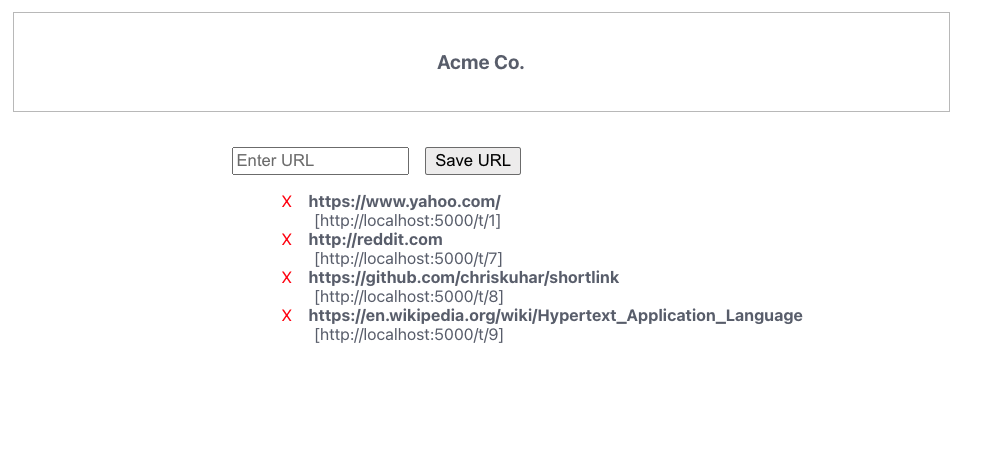
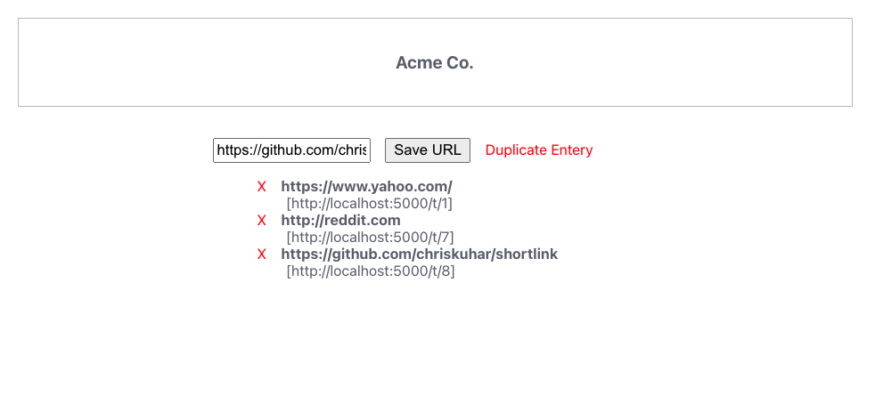
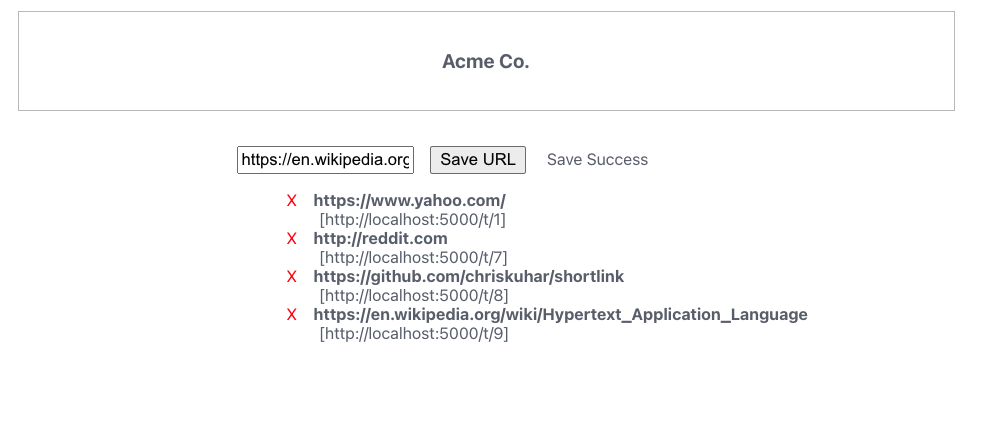

# URL Shortener

## Architecture

the front end is React, using classes and state variables.

The backend has two components: Node Express and json-server.  Json-server is a simple API server which mimics the real world problem of a service interacting with another service. 

## Startup

Front end:

    cd app
    npm install --legacy-peer-deps
    npm run start

NOTE: using yarn works much better, you don't need the --legacy-peer-deps flag

Know bug, the input box does not empty after successfully adding a new url, it should.

Back end: 

    cd link-service
    npm install
    npm run start  [this start both services]

## Features

    
Examples of short links app

        "
        "
        "

- [ ] Enter URL prefixed with (http(s)://) in the input text box, click Save URL to save the URL.  The list will be updated with the new entry or an error will be presented.
- [ ] Clicking on the *bold* url link will open another tab loading the URL.  
- [ ] Clicking on the red 'X' will delete the item, and the list will refresh
- [ ] The list contains two links, the live one is a representation of the short link, hovering over the link it can be observed the short link is present.  Look at the network tab to observe the API call.
- [ ] The data is persistent, reloading the page will reload the data from the database.  Restarting the backend services will not erase the data, json-server writes the DB to disk. 

## Requirements: 

We'd like you to build a web site that functions as a URL Shortener:

- [ ] A user should be able to load the index page of your site and be presented with an input field where they can enter a URL.
- [ ] Upon entering the URL, a "shortened" version of that url is created and shown to the user as a URL to the site you're building.
- [ ] When visiting that "shortened" version of the URL, the user is redirected to the original URL.
- [ ] Additionally, if a URL has already been shortened by the system, and it is entered a second time, the first shortened URL should be given back to the user.
 
